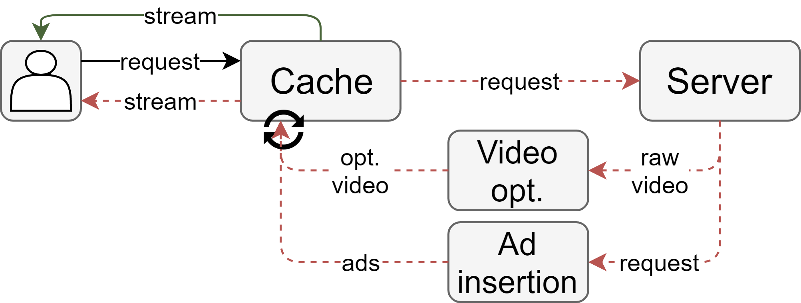
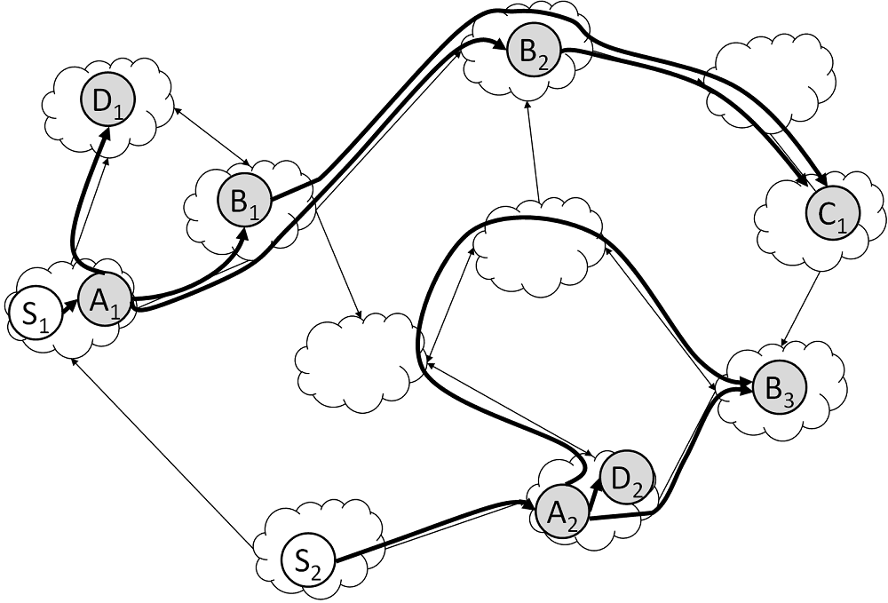
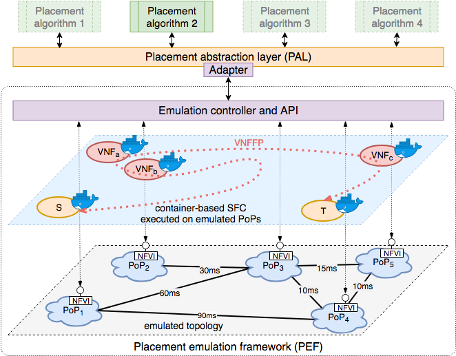

I'm a PhD candidate and researcher at the [computer networks group at Paderborn University](https://cs.uni-paderborn.de/cn/). My research focus is on 5G, network softwarization/virtualization, and cloud computing, but I am also interested in machine learning and applying it to the networking domain.

I enjoy tackling and solving challenging problems and am always looking to learn something new. If you are interested in collaborating, feel free to contact me.

# Research topics

Most of my research focuses on automated, optimized coordination or management of network services in network function virtualization (NFV) and distributed cloud computing. In my research, I consider the whole lifecycle from specification of services, their orchestration, and their evaluation.

## Specification of network services

### Specification and analysis of network services using Petri nets

For optimal placement and orchestration of network services, it is crucial that their structure and semantics are specified clearly and comprehensively and are available to an orchestrator. Existing specification approaches are either ambiguous or miss important aspects regarding the behavior of virtual network functions (VNFs) forming a service. We propose to formally and unambiguously specify the behavior of these functions and services using Queuing Petri Nets (QPNs). QPNs are an established method that allows to express queuing, synchronization, stochastically distributed processing delays, and changing traffic volume and characteristics at each VNF. With QPNs, multiple VNFs can be connected to complete network services in any structure, even specifying bidirectional network services containing loops.

We propose a tool-based workflow that supports the specification of network services and the automatic generation of corresponding simulation code to enable an in-depth analysis of their behavior and performance. In a case study, we show how developers can benefit from analysis insights, e.g., to anticipate the impact of different service configurations. We also discuss how management and orchestration systems can benefit from our clear and comprehensive specification approach and its extensive analysis possibilities, leading to better placement of VNFs and improved Quality of Service.

* [Conference paper (pre-print)](https://ris.uni-paderborn.de/record/3287)
* [Source code (GitHub)](https://github.com/CN-UPB/ns-simulation-compiler)

## Coordination of network services

### B-JointSP: Scaling and Placing Bidirectional Services with Stateful Virtual and Physical Network Functions

B-JointSP is an optimization problem focusing on the *joint scaling and placement* of NFV network services, consisting of interconnected virtual network functions (VNFs), as well as routing of flows from sources through these VNFs. The exceptional about B-JointSP is its consideration of *realistic, bidirectional network services*, in which flows return to their sources and may have a non-linear service structure. It even supports *stateful VNFs* that need to be traversed by the same flows in both upstream and downstream direction. Furthermore, B-JointSP allows the reuse of VNFs across different network services and supports physical, legacy network functions.

To solve B-JointSP, we formalized it as mixed integer linear program (MILP), which can be used to find optimal solutions, but is NP-hard (see proof in paper). Hence, we also designed an efficient heuristic algorithm that finds close-to-optimal solutions even for large problem instances within seconds.

* [Conference paper](https://ieeexplore.ieee.org/document/8459915)
* [Source code (GitHub)](https://github.com/CN-UPB/B-JointSP)

## Evaluation of network service placement

### Abstraction layer and emulation platform for VNF placement algorithms

In recent years, a variety of different approaches have been proposed to tackle the problem of scaling and placing network services, consisting of interconnected virtual network functions (VNFs). In this work, we present a placement abstraction layer (PAL) that provides a clear and simple northbound interface for using such algorithms while hiding their internal functionality and implementation. 
Through its southbound interface, PAL can connect to different back ends that evaluate the calculated placements independent of the calculated performance claims made by the algorithms themselves, e.g., using simulations, emulations, or testbed approaches. As an example for such evaluation back ends, we introduce a novel placement emulation framework (PEF) that allows executing calculated placements using real, container-based VNFs on real-world network topologies. In a case study, we show how PAL and PEF facilitate reusing and evaluating placement algorithms as well as validating their underlying models and performance claims.

* [Conference paper (pre-print)](https://ris.uni-paderborn.de/record/6972)
* [Source code (GitHub)](https://github.com/CN-UPB/placement-emulation)

# Publications

You can find an up-to-date list of my publications here:

* [My university's research archive (with open-access PDFs for most publications)](https://ris.uni-paderborn.de/person/stefanschneider)
* [My Google Scholar profile (with citation counts)](https://scholar.google.com/citations?user=https://scholar.google.de/citations?user=7fimejMAAAAJ&hl=en&user=7fimejMAAAAJ)

